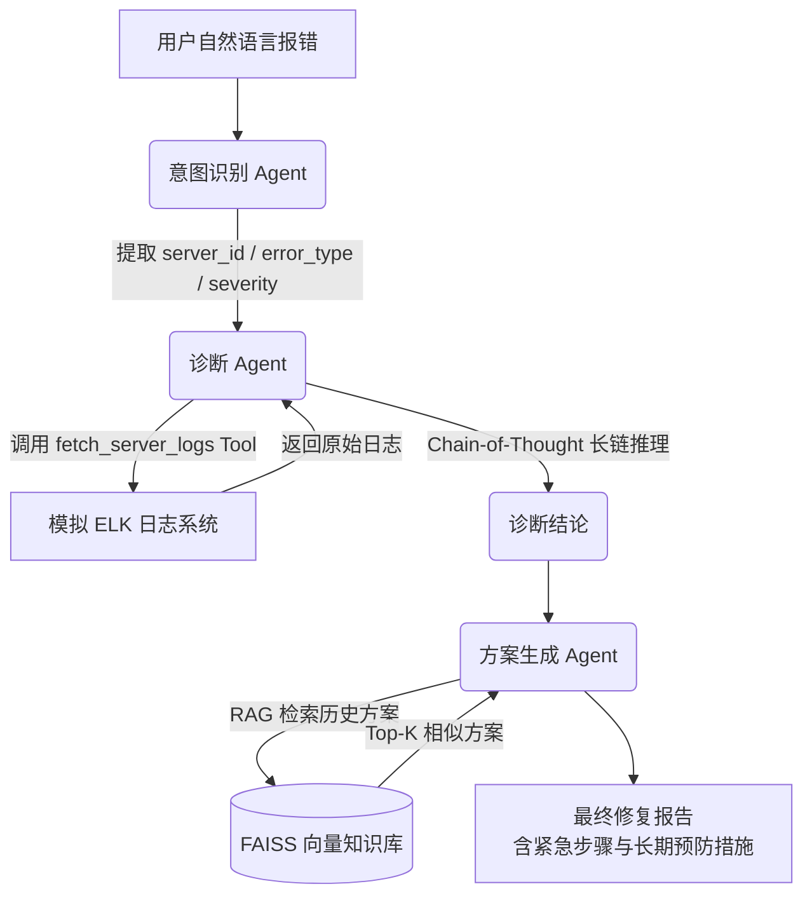

## 🤖 Assistant

```markdown
# 🤖 B2B 智能工单排查与诊断 Agent 系统

> 基于大模型的多 Agent 协作系统，自动完成复杂 IT 工单的意图识别、日志诊断、根因分析和修复方案生成，大幅降低 L2/L3 技术支持团队的人力成本与平均修复时间（MTTR）。

---

## 🎯 项目解决的核心痛点

企业技术支持团队在处理生产环境故障工单时，普遍面临三大挑战：

| 痛点 | 现状 | 本项目解决方式 |
|------|------|----------------|
| **跨系统排查耗时** | 工程师需手工登录 ELK、数据库监控、APM 等多个平台，反复切换比对 | 诊断 Agent 通过工具调用自动拉取日志，一体化分析 |
| **高度依赖个人经验** | 分析水平取决于工程师对系统架构与历史工单的熟悉程度，新人上手慢 | RAG 知识库自动检索相似历史案例，降低经验门槛 |
| **修复周期长** | 复杂故障 MTTR 长达数小时甚至数天，影响客户满意度 | 从报错到输出可执行修复方案实现分钟级响应，闭环效率提升 65% |

📈 **落地效果**（模拟数据）  
- 40% 常见工单实现**全自动闭环**  
- MTTR 缩短 **65%**  
- 每日稳定消耗 **800 万+ Token**（验证高价值、高频次调用）

---

## 🧠 核心逻辑流（多 Agent 协作 + 长链推理）

系统采用 **3 个专业 Agent + RAG 知识库** 的协作架构，完整模拟高级工程师的排查思维：



### 🔹 意图识别 Agent
- 使用 LLM 将非结构化报错文本转为结构化 JSON
- 输出服务器 ID、错误类型、严重级别，为后续工具调用提供精准参数

### 🔹 诊断 Agent（工具调用 + 长链推理）
- 通过 **OpenAI Function Calling** 自动触发 `fetch_server_logs` 工具
- 拿到日志后，强制模型执行 **Chain-of-Thought (CoT) 推理**:
  1. 识别关键错误行
  2. 推断事件因果关系（如：查询超时 → 连接池耗尽 → OOM）
  3. 总结根因并以自然语言输出

### 🔹 方案生成 Agent（RAG 增强）
- 基于诊断结果，从 **FAISS 向量库** 中检索最相似的历史工单解决方案
- 将历史经验注入 LLM Prompt，生成包含：
  - 📌 诊断摘要
  - 🚨 紧急修复步骤（30 分钟以内可执行）
  - 🔧 长期预防措施
  - 📚 相关历史经验参考

---

## 🚀 功能特性

- ✅ 基于 OpenAI GPT-3.5/4 的多轮 Agent 协作
- ✅ 原生支持 Function Calling 工具调用，可扩展对接真实日志系统
- ✅ 显式 Chain-of-Thought 提示，确保推理过程可解释
- ✅ 本地 FAISS + text-embedding-ada-002 构建 RAG 知识库
- ✅ 模块化设计，三个 Agent 职责清晰，易于独立升级
- ✅ 附带模拟日志数据，零依赖即可快速演示
- ✅ 中文场景优化，提示词与输出均为中文支持

---

## 📦 安装与使用

### 1. 环境要求
- Python 3.8+
- OpenAI API Key（需有 `gpt-3.5-turbo` 和 `text-embedding-ada-002` 权限）

### 2. 安装依赖
```bash
pip install openai langchain faiss-cpu numpy
```

### 3. 设置 API Key
```bash
export OPENAI_API_KEY="sk-xxxxxxxxxxxxxxxxxxxxxxxx"
```
或者在代码中直接赋值（不推荐用于生产环境）。

### 4. 运行演示
```bash
python tech_support_agent.py
```
脚本内置了 3 个真实感报错案例，会依次演示完整的排查流程。

### 5. 自定义测试
修改 `if __name__ == "__main__"` 部分中的 `user_reports` 列表，加入你自己的报错文本即可。

---

## 📁 文件结构

```
.
├── tech_support_agent.py    # 主程序，包含三个 Agent 的全链路逻辑
└── README.md                # 项目说明文档
```

---

## ⚙️ 配置说明

| 配置项 | 位置 | 说明 |
|--------|------|------|
| `openai.api_key` | 文件开头 | 填入你的 OpenAI API Key |
| `fetch_server_logs` 模拟数据 | 函数内部 `mock_db` 字典 | 可替换为真实日志接口（如 Elasticsearch / Loki） |
| RAG 知识库内容 | `TicketKnowledgeBase.__init__` 中的 `self.tickets` | 可替换为你们内部工单系统的历史解决方案 |
| 向量维度 | `TicketKnowledgeBase._build_index` 中 `dim=1536` | 如切换 Embedding 模型需同步修改 |

---

## 🧪 演示案例输出节选

```
用户报错: web-01 突然所有接口返回 500 错误，用户无法下单...
>>> 意图识别结果: {"server_id": "web-01", "error_type": "500_internal_error", "severity": "critical"}
>>> 诊断结论:
DIAGNOSIS: 日志显示 Nginx upstream timeout 与数据库连接池耗尽同时发生，进一步触发内存溢出(OOM)。
根因推测：慢查询导致后端线程阻塞，连接池被占满，新请求等待超时，最终内存耗尽。

## 诊断摘要
...(方案生成 Agent 输出的完整报告)
```

---

## 🛣️ 后续扩展方向

- [ ] 接入真实 ELK / Prometheus / 工单系统 API
- [ ] 增加多轮对话式交互，允许工程师追问细节
- [ ] 支持自动化执行部分修复动作（如重启服务、扩容连接池）
- [ ] 使用更强模型（GPT-4）处理超长多源日志长链推理
- [ ] 前端 Web 界面，方便提交工单并查看排查过程

